# Docker Notes

## Part 1: Core concepts

### Container vs virtual machine
A **container** is a loosely isolated, runnable instance/environment of an image that packages an application together with its dependencies(runtime, libraries, config) and all that is needed to run the application on any computer with Docker. 
It is lightweight, starts in milliseconds and shares the host's operating system rather than building its own.

A **virtual machine** mimics a computer and runs/ships a full guest operating system on a hypervisor (software that allows to run one or more virtual machines on a single physical machine).

| | Container | Virtual machine |
|---|---|---|
| OS | Shares the host's kernel | Has its own full guest OS |
| What it virtualises| Operating system | Hardware |

### Image vs container vs volume vs network
- **Image** - a standardized package/template that includes all of the app files, libraries, and configurations to run a container, built from a Dockerfile. Images cannot be modified once they are created but changes can be added on top of it or a new image can be created.
- **Container** - a instance of an image, like an object created from a class. Multiple container instances can be run from one image.
- **Volume** - Volumes are data stores for containers, that are created and managed by Docker and are isolated from the core functionality of the host machine. When a volume is created, it's stored within a directory on the Docker host and this directory is what's mounted into the container. When the container is removed its own filesystem is also removed, but volume data stays, therefore databases need volumes.
- **Network** - Compose automatically creates a default network per project. It allows containers to connect to and communicate with each other, as well as with non-Docker network services using the container port. Services/containers on the same network can reach each other by name (for example, `backend` connects to `db:5432`).

### Registry
A **registry** is a server that stores and manages Docker images. It contains repositories where one or more container images are stored. Images are shared across teams through these registries, which allows teams to have the same configurations for all stages of CI/CD and deployments.
- **Docker Hub** is the default public registry that anyone can use. `node:22` comes from there.
- **Private registries** such as AWS ECR, Azure ACR, GitLab Container Registry and so on, hold a company's own images, and require the user to log in to use them.
- `docker pull` downloads an image from the configured registry
- `docker push` uploads an image to a registry

With the app containerized, developers just have to pull the latest images from the registry, do their work locally, and then push their changes back to the registry.

### Image layers and build caching
Container images are composed of layers where each of these layers, once created, are immutable.
Each instruction in a Dockerfile creates a **layer** (`FROM`, `COPY`, `RUN`, and so on). 
These layers allows one to extend other images by reusing their base layers, allowing to add only the data that your application needs.
Docker caches layers, and on a rebuild it reuses them until one of the input has changed. That specific layer and every layer after it are rebuilt.
Layering make builds faster and reduce the amount of storage and bandwidth required to distribute the images.

The instructions in the docker file are arranged from least-changing to most-changing, as shown below;

```dockerfile
COPY package*.json ./   # changes rarely
RUN npm install         # slow, but cached while package.json is unchanged
COPY . .                # code changes often, so only this step reruns
```

If `COPY . .` came before `npm install`, everytime code changes it would reinstall all the dependencies.

---

## Part 2: Docker CLI basics

### Container commands
| Command | What it does |
|---|---|
| `docker run -d --name dockerTest nginx` | Creates and starts a container (`-d` runs the command in the background) |
| `docker ps` | Lists the running containers | 
| `docker ps -a` | Lists all containers, including stopped instances |
| `docker stop dockerTest` | Stops a running container |
| `docker start dockerTest` | Starts a stopped container |
| `docker rm dockerTest` | Deletes a stopped container|
| `docker rm -f dockerTest` | Deletes a running container by force |
| `docker logs -f dockerTest` | Shows the container's output (`-f` keeps following it) |
| `docker exec -it dockerTest sh` | Opens an interactive shell inside a running container |

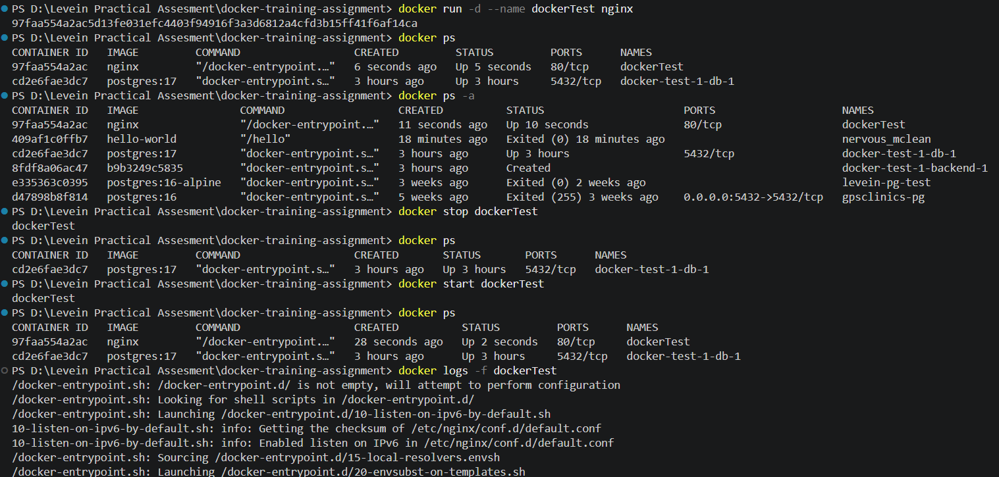
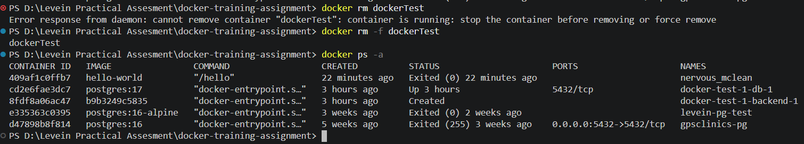

### Images and cleanup
| Command | What it does |
|---|---|
| `docker images` | Lists the local images |
| `docker pull postgres:17` | Downloads an image |
| `docker rmi postgres:17` | Deletes an image (fails if a container is still using it) |
| `docker system prune` | Deletes unused containers, images, networks, and build cache |

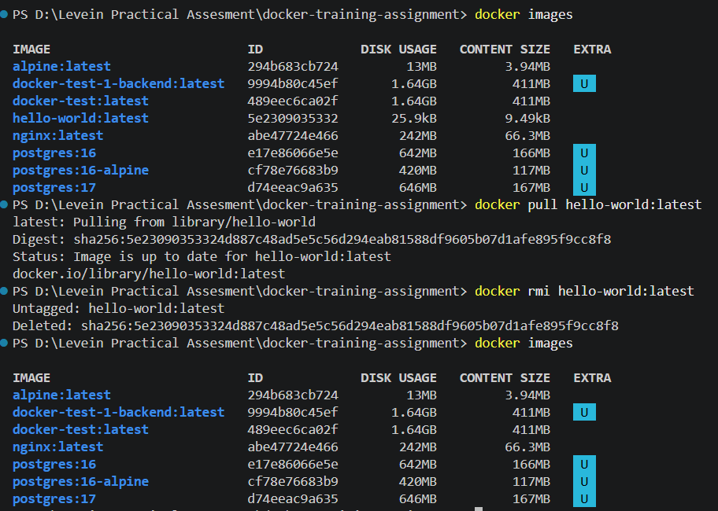
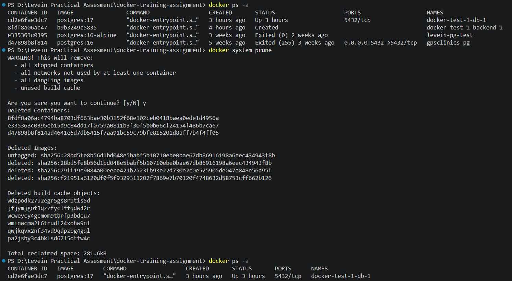

**Beware when using `system prune`**, as it deletes stopped containers, unused networks, untagged images, and build cache by default. **`system prune -a`** removes all images not used by any container, while **`system prune --volumes`** removes unused volumes, which means losing data.

### Ports, env vars and storage (volume)
- **`-p 8080:80`** - maps a host port to a container port (`host:container`). Eg:- `localhost:8080`.
- **`-e KEY=value`** - sets an environment variable. 
- **`--env-file .env`** - loads all environment variables from a file.
- **Bind mount** - maps a host folder into the container. 
- **Named volume** - storage that Docker manages. Best for database data.

```powershell
# Port mapping -> host:container
docker run -d --name testPort -p 8080:8080 nginx:alpine # Creates and starts a new container with a given name
# OR
docker run -p 8080:80 nginx:alpine  # Creates and starts a new container with a random name 
curl http://localhost:8080

# Inline Environment variables 
docker run -e ENV=key alpine:latest 

# Environment variables from a file
echo "ENV=key" > .env
docker run --env-file .env alpine:latest 

# Bind mount
mkdir hostdir && echo "host file" > hostdir/file.txt
docker run --mount type=bind,src="${PWD}/hostdir",dst=//data alpine:latest cat //data/file.txt
# OR
docker run -v "${PWD}/hostdir:/data" alpine:latest cat /data/file.txt

# Named volume
docker volume create testvol
docker volume ls
docker run --mount type=volume,src=testvol,dst=//data alpine:latest
# OR
docker run -v testvol:/data alpine:latest
```

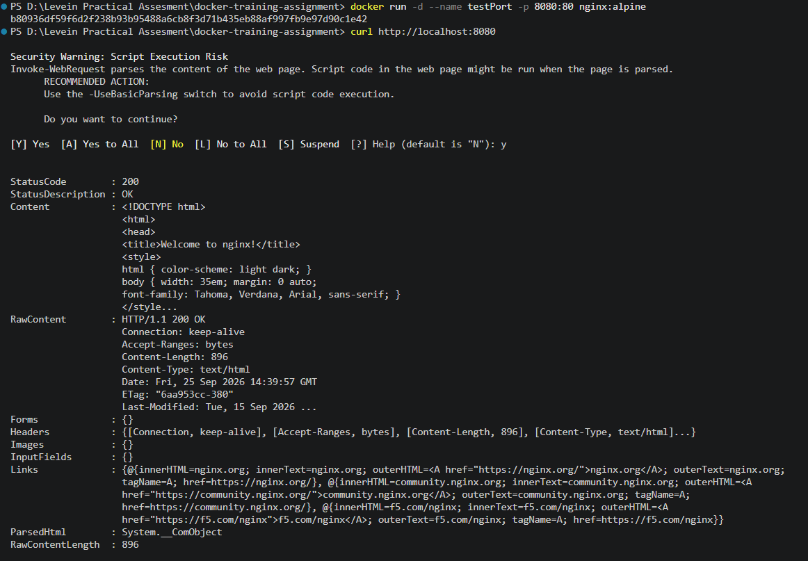
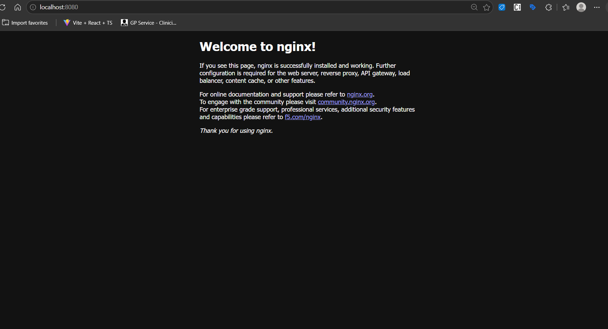
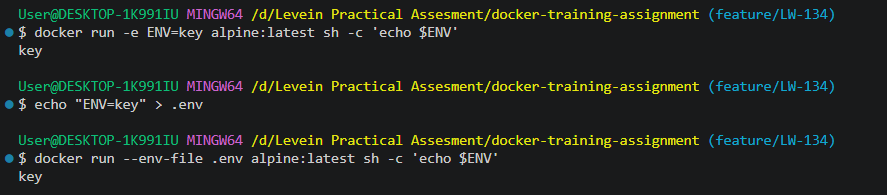
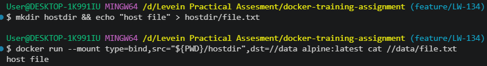
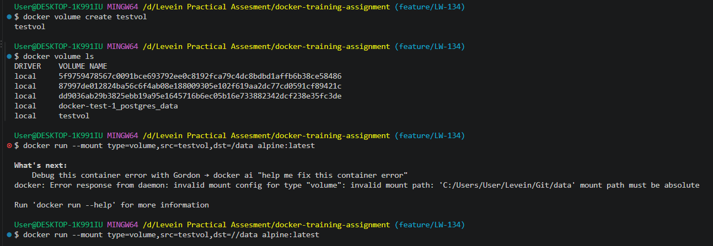

### Exercise:- Data remains after removing the container
```powershell
# Postgres container with a named volume
docker run -d --name dockerTestpg -e POSTGRES_PASSWORD=pass -v pgVol:/var/lib/postgresql/data postgres:17  

# Create table with a row
docker exec -it dockerTestpg psql -U postgres -c "CREATE TABLE test (name text); INSERT INTO test VALUES ('John Doe');" 
docker stop dockerTestpg
docker rm dockerTestpg

# New container, but same volume
docker run -d --name pgTest -e POSTGRES_PASSWORD=pass -v pgVol:/var/lib/postgresql/data postgres:17
docker exec -it pgTest psql -U postgres -c "SELECT * FROM test;"   # returns 'John Doe'
```

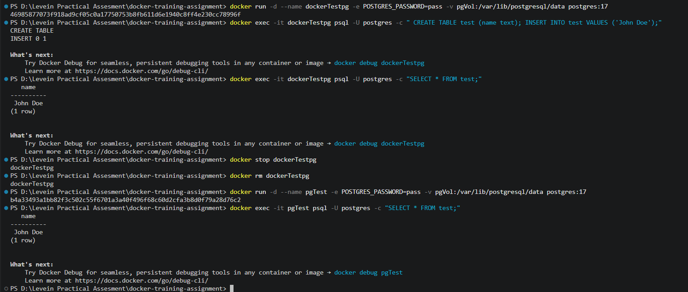

Even though the container was deleted, the data lived in the volume, therefore the new container display the existing data.

---

## Part 3: Writing a Dockerfile

### The project's Dockerfile
```dockerfile
# Uses node version 22 as the base image
FROM node:22

# Goes to the app directory (like a cd terminal command)
WORKDIR /app

# Copy the dependencies first for caching (if available)
COPY package*.json ./

# Install app dependencies (runs at build time and creates a layer)
RUN npm install

# Copy the rest of the app into the container
COPY . .

# Set port environment variable
ENV PORT=9000

# Expose the port so the computer can access it
EXPOSE 9000

# Run the app
CMD ["npm", "start"]
```

```powershell
# To build the image
docker build -t docker_example .  #t is for tag and . is the path

# To run the container
docker run -p 9000:9000 docker_example  # p is port forwarding
```
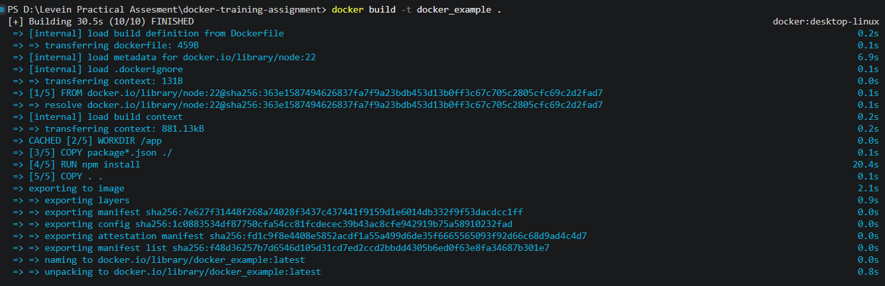

### CMD vs ENTRYPOINT
- **`RUN`** command runs while the image is being **built** while **`CMD`** and **`ENTRYPOINT`** run when a container **starts**.
- **`CMD`** is the default command, and it's easy to override. For example, running `docker run docker-example` uses the image's default CMD, but `docker run docker-example sh` replaces it with sh.
- **`ENTRYPOINT`** is the fixed executable, and anything that is passed to `docker run` becomes its arguments.
- Both CMD and ENTRYPOINT are often used together, with ENTRYPOINT as the program and CMD as its default arguments:
  ```dockerfile  
  ENTRYPOINT ["node"]
  CMD ["server.js"]  
  ```

### .dockerignore
This file includes a list of files to exclude out of the build context (similar to a .gitignore file). This allows to build faster, keeps images smaller and keeps secrets out of the image.

### Multi-stage builds

```dockerfile
FROM node:22 AS build
WORKDIR /app
COPY package*.json ./
RUN npm install
COPY . .

FROM node:22-alpine AS runtime
ENV PORT=9000
WORKDIR /app
COPY --from=build /app .
EXPOSE 9000
CMD ["npm", "start"]
```

```powershell
# To build the multistage image
docker build -f Dockerfile.multistage -t docker-test .
```

The following image shows the the sizes of the docker images;

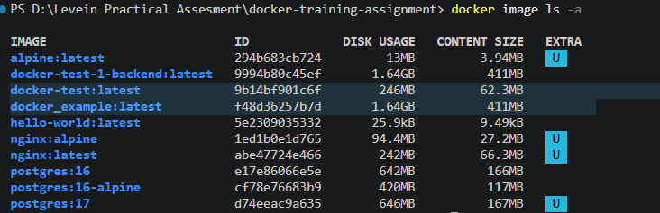

The single-stage image (docker_example) size is 411MB, while the multi-stage image (docker-test) is 62.3MB.

---

## Part 4: Docker Compose

Docker compose defines and runs multi-container applications in a file called `docker-compose.yml`. It basically instructs the containers how to work together to create the full application. 
- **`backend`** - is the app service built from the Dockerfile, which is published on port 9001.
- **`db`** - `postgres:17`, with data stored in the `postgres_data` named volume.
- **`depends_on: db`** - starts the `db` before `backend`. 
- **Service networking** - both the services (backend and db) are on `app-network`, so the app connects with host name `db` (`postgres://user:pass@db:5432/testdb`). 
- **`.env`** - Compose reads the `.env` automatically and the `env_file` passes it into the container. 

### The project's `docker-compose.yml`

```yaml
services:
  # Node.js application service
  backend:
    build:
      # Build context for Docker
      context: .
      # Builds the app with the Dockerfile
      dockerfile: Dockerfile
    ports:
      # Maps port host:container
      - '9001:9000'
    environment:
      # Compose fetches values from the .env file
      DATABASE_URL: postgres://${POSTGRES_USER}:${POSTGRES_PASSWORD}@db:5432/${POSTGRES_DB}
    depends_on:
      # Starts the database service before starting the backend
      - db
    networks:
      # Places both services on the same network
      - app-network

  # PostgreSQL database service
  db:
    image: postgres:17
    # Sets up the initial database using environment variables from the .env file
    env_file:
      - .env
    volumes:
      # Keeps database files in a named volume across container
      - postgres_data:/var/lib/postgresql/data
    networks:
      - app-network

volumes:
  # Docker-managed storage for PostgreSQL data
  postgres_data:

networks:
  # Shared network that allows the backend connect to the database by the service name
  app-network:
```

### Docker Compose Commands
| Command | What it does |
|---|---|
| `docker compose up -d` | Builds creates and starts containers for a service in the background |
| `docker compose build` | Rebuilds the images after changing the code or Dockerfile |
| `docker compose ps` | Shows the status of the containers |
| `docker compose logs -f backend` | Follows one service log outputs |
| `docker compose exec db psql -U user testdb` | Runs a command within a running service |
| `docker compose down` | Stops and removes the containers and network but **keeps the volumes** |
| `docker compose down -v` | Same as `docker compose down`, but **deletes the volumes** |

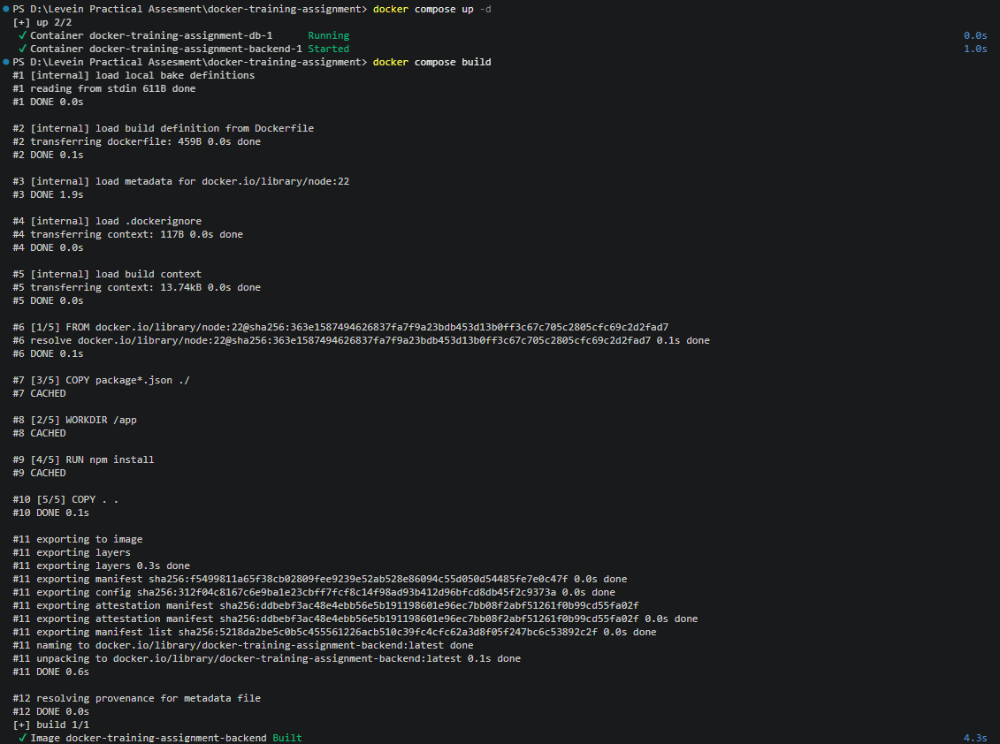
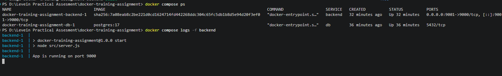
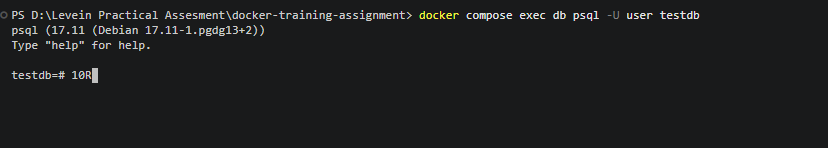
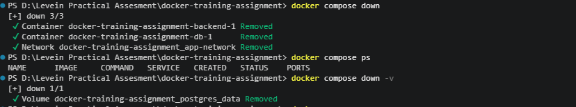

### Why `down -v` is dangerous on a shared or real data setup?
`down -v` command deletes the named volumes, which means the whole Postgres database would be deleted, such that on a shared or a real data setup where others depend on that data would not be able to access it again. Best preferred to take a backup, before using the command locally for a clean reset.

---